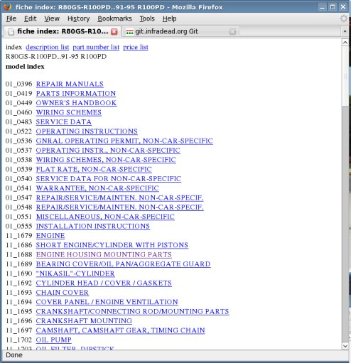
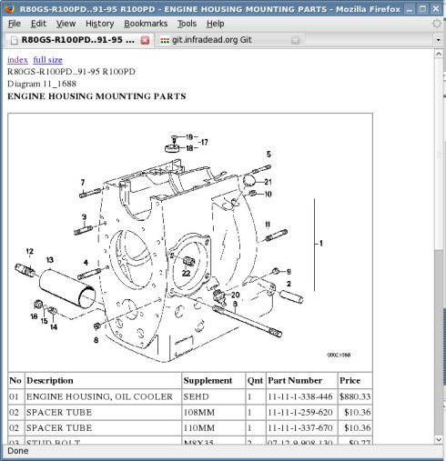

# fiche-maker

Web scraper to filter parts fiche pages into a more compact and usable form. It filters out all the unneeded things and creates minimal HTML fiche pages, an HTML index, and some lists that have all the parts sorted by number, description, etc.

## Usage

    wget \
      --recursive \
      --page-requisites \
      --convert-links \
      --no-parent  \
      --accept 'diagram.php*,jpg' \
      --exclude-directories='/moto_photos,/images,/product_photos' \
      'http://www.webparts.com/mgfg.php?series=K66&model=R100PD'

    find . -name 'diagram.php*' | ./fiche-maker-batch -o =K66-R100PD

## Output

### Generated index page

### Generated parts page

